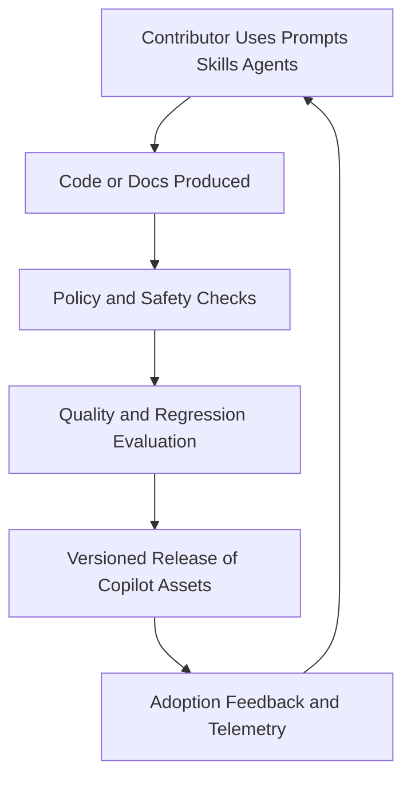

# Copilot Setup Modernization

## Problem Frame

This repository already provides a comprehensive Copilot operating system (prompts, skills, agents, chatmodes, hooks, setup scripts, and documentation), but it has grown into a high-surface template where drift risk and governance overhead are increasing.

Recent shifts in AI engineering practice emphasize three outcomes working together: stronger quality evidence (evaluation and drift controls), stronger operator trust (policy and guardrails), and lower friction for day-to-day contributors. The current repo has strong building blocks, but lacks a unified modernization pass that aligns these outcomes into one maintainable system.

## Requirements

**Quality Reliability And Drift Control**

- R1. Define a single source of truth manifest for shipped Copilot assets (prompts, skills, agents, chatmodes, instructions, setup outputs), with explicit ownership per asset and generated-vs-committed boundaries.
- R2. Add a hybrid evaluation baseline for core slash prompts and key skills: deterministic checks plus rubric-based checks with bounded retries and thresholded pass/fail release gating.
- R3. Introduce a compatibility matrix for model names and capabilities, with fail-closed behavior for gated workflows and controlled fallback behavior for advisory workflows when a configured model is unavailable.
- R4. Add release-level changelog discipline for Copilot assets so teams can identify behavioral changes between versions without reading diffs manually.

**Governance And Security**

- R5. Define least-privilege MCP profiles (read-only, standard, elevated) with default read-only posture and explicit per-task elevation requirements.
- R6. Expand guardrails to include policy checks for high-risk automation paths (for example: destructive command patterns, broad cloud permissions, and secret handling hygiene) using a two-phase rollout: warn-only burn-in, then blocking enforcement.
- R7. Establish a governance checklist for introducing new prompts, skills, agents, and hooks, including required metadata and ownership.

**Developer Experience And Adoption**

- R8. Provide a guided onboarding path that verifies local prerequisites and gives role-based quick starts for common contributor personas.
- R9. Add discoverability improvements so contributors can reliably find the right prompt/skill/agent path for a task without searching the full tree.
- R10. Add a lightweight health dashboard artifact with dual outputs: JSON as the canonical machine-readable source and Markdown as the human-readable summary after setup or updates.

**Scalability Of Repository Maintenance**

- R11. Reduce duplicated guidance across docs where possible and introduce a consistency check to flag stale or conflicting instructions.
- R12. Define a deprecation lifecycle for prompts/skills/agents (announce, minimum 60-day grace period, removal) to prevent unbounded growth and stale capabilities.

## Success Criteria

- Core prompt and skill evaluation suite runs in CI with deterministic and rubric tracks, bounded flake retries, and visible pass/fail outcomes for each release.
- Drift checks reliably detect mismatches between generated setup outputs and committed repository assets.
- Model compatibility policy is enforced, including fail-closed behavior for gated workflows and explicit fallback reporting for advisory workflows.
- New Copilot capabilities cannot be merged without declared owner, metadata, and governance checklist completion.
- High-risk policy checks complete warn-only burn-in and transition to blocking mode with documented false-positive thresholds.
- Contributors can complete first-time setup and run one validated workflow in under 15 minutes with documented steps.
- Contributors can discover and select an appropriate prompt/skill/agent path for a representative task in three steps or fewer.
- At least one release cycle demonstrates clear changelog entries and deprecation communication for Copilot assets.
- Median time-to-merge for Copilot asset changes improves versus the pre-modernization baseline without increasing policy exceptions.

## Scope Boundaries

- No redesign of the product domain represented by example prompts; this effort focuses on Copilot operating system quality and governance.
- No mandatory migration to a single model vendor; the multi-model strategy remains in scope and is strengthened.
- No broad rewrite of all existing skills; prioritize high-impact standardization and guardrails first.

## Key Decisions

- Balanced modernization across reliability, governance, and DX: this matches the selected user priority and prevents local optimization that harms adoption.
- Reuse and extend existing structure instead of replacing it: the repository already contains mature assets that should be hardened, not restarted.
- Introduce phased delivery with visible checkpoints: this reduces rollout risk and enables measurable progress.
- Phase sequence: Phase 1 foundation (manifest, eval policy, compatibility policy), Phase 2 governance hardening (MCP profiles and policy rollout), Phase 3 DX and maintenance scale (onboarding, discoverability, doc consistency, deprecation operations).
- Phase exit and pivot criteria: advance only when the prior phase meets its linked success criteria; reorder next-phase scope if success criteria are missed for two consecutive iterations or if time-to-merge regresses versus baseline.

## Dependencies / Assumptions

- Assumes current workflow files and hook mechanisms remain available as enforcement points.
- Assumes maintainers can assign clear ownership for critical Copilot assets.
- Assumes CI environment supports adding one or more additional validation/evaluation jobs.

## Outstanding Questions

### Resolve Before Planning

- None.

### Deferred to Planning

- [Affects R2][Needs research] Which evaluation harness format best fits this repo's mix of prompts, skills, and agents with minimal maintenance cost?
- [Affects R5][Needs research] Which MCP tools should be in each least-privilege profile based on observed task patterns?
- [Affects R6][Technical] What false-positive threshold should trigger transition from warn-only to blocking policy checks for each check category?

## Alternatives Considered

| Approach                                    | Summary                                                     | Pros                                          | Cons                                     | Best Fit                                     |
| ------------------------------------------- | ----------------------------------------------------------- | --------------------------------------------- | ---------------------------------------- | -------------------------------------------- |
| Governance-first hardening                  | Start with policy and safety controls only                  | Fastest risk reduction                        | Can slow contributor adoption if UX lags | Immediate compliance pressure                |
| DX-first simplification                     | Prioritize onboarding and discoverability first             | Fastest team adoption                         | Quality and drift risk may persist       | Early-stage teams with low governance load   |
| Balanced phased modernization (recommended) | Deliver reliability, governance, and DX in sequenced phases | Best long-term operating model and durability | Requires stronger planning discipline    | Teams scaling usage across many contributors |

## Next Steps

Begin planning with a timeboxed discovery segment to close deferred research items tied to R2, R5, and R6, then execute phased delivery using the phase exit and pivot criteria above.

→ /ce-plan for structured implementation planning
